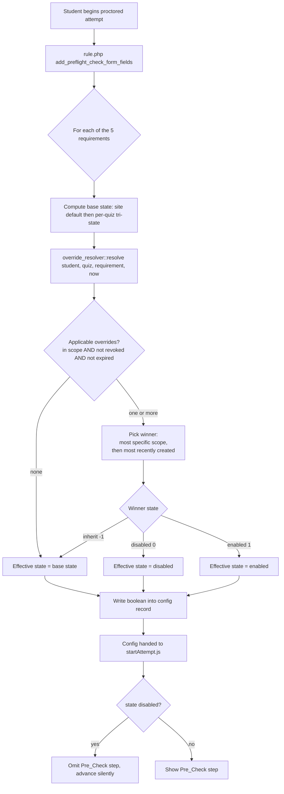

# Design Document

## Overview

This feature adds a **per-student proctoring override** layer to the `quizaccess_proctoring`
plugin. Today the plugin resolves each proctoring requirement from a site default and an
optional per-quiz tri-state setting (`-1` inherit / `0` disabled / `1` enabled). This design
introduces a third, highest-precedence resolution layer that lets a capability-gated Student
Affairs reviewer waive (or force) individual proctoring requirements for one specific student,
optionally scoped to a single quiz.

The design is deliberately shaped to reuse the plugin's existing conventions:

- The override state for each requirement uses the same integer tri-state (`-1`/`0`/`1`) already
  used by `requireentirescreen`, `riskreviewmode`, and `captchamode`, so the new layer slots
  cleanly into the resolution helpers in `rule.php`.
- Persistence follows the existing XMLDB patterns (int timestamps `timecreated`/`timemodified`,
  `courseid`/`quizid`/`userid` columns, `NOTNULL` integer status flags, non-unique indexes on
  lookup columns), matching tables such as `quizaccess_proctoring_risk_holds` and
  `quizaccess_proctoring_ai_reviews`.
- Requirement resolution is centralized in a new `classes/local/override_resolver.php` helper so
  that `rule.php` (and any future consumer) has a single, testable place to compute the
  `Effective_Requirement_State` for a `{student, quiz}` pair.

The five in-scope requirements are **CAPTCHA**, **Webcam** (face register/validate),
**ID_Verification**, **Screen_Share** (entire-screen), and **Multi_Monitor**.

The feature also **supersedes** Requirement 9 ("Override / Exemption Path for Webcam and ID") of
the `proctoring-feedback-improvements` spec. That narrower webcam/ID exemption is subsumed by
this general per-requirement layer; coexistence and migration are addressed in
[Design Decisions](#design-decisions) and [Migration and Coexistence](#migration-and-coexistence).

### Goals

- Waive or force any subset of the five in-scope requirements for a single student.
- Resolve deterministically with per-student overrides winning over per-quiz and site settings.
- Never change the experience of any student outside an override's scope.
- Skip waived Pre_Check steps cleanly client-side (no student action, no error).
- Record who/why/when/what for every override, with an append-only audit trail.
- Support optional expiry and revocation with correct in-progress-attempt behavior.
- Surface overrides in a reviewer coordination view alongside native quiz overrides.

### Non-Goals

- Per-student CAPTCHA provider or key selection (site-wide only; out of scope).
- Modifying Moodle core's `quiz_overrides` table or core override UI (read-only coordination
  only).
- Per-group override scope (noted as an optional future extension in requirements; the schema
  leaves room for it but it is not implemented here).

## Architecture

The override layer plugs into the existing settings-resolution path. The core insight is that
`rule.php` already computes each requirement's boolean "required?" outcome just before building
the config record handed to `amd/src/startAttempt.js`. We inject the override resolution at that
exact point so waived requirements produce `false` and their Pre_Check steps are omitted
client-side.

### Component layout

```
mod/quiz/accessrule/proctoring/
├── rule.php                                  # MODIFIED: calls override_resolver in resolution helpers
├── classes/local/override_resolver.php       # NEW: pure resolution logic (site→quiz→override)
├── classes/local/override_manager.php        # NEW: create/edit/revoke + audit writes (CRUD + validation)
├── classes/external.php                       # (unchanged for MVP; form-post admin used instead of AJAX)
├── manage_overrides.php                       # NEW: reviewer admin page (list/create/edit/revoke + coordination view)
├── classes/form/override_form.php             # NEW: moodleform for create/edit
├── db/access.php                              # MODIFIED: add quizaccess/proctoring:manageoverrides
├── db/install.xml                             # MODIFIED: add two new tables
├── db/upgrade.php                             # MODIFIED: upgrade step creating the two new tables
├── db/services.php                            # (unchanged for MVP)
├── settings.php                               # (unchanged; no new site settings required)
├── amd/src/startAttempt.js                    # MODIFIED: honor per-requirement waivers already in config
└── lang/en/quizaccess_proctoring.php          # MODIFIED: strings for capability, form, view, errors
```

### Resolution flow (attempt start)



### Scope specificity model

An override's `Override_Scope` is `{userid} + optional {quizid}`. Two specificity levels exist:

| Scope | quizid | Applies to |
|-------|--------|------------|
| Quiz-scoped (more specific) | set | Only the target student's attempts on that quiz |
| Course-scoped (less specific) | `0` | All proctored quiz attempts by the target student in the course context |

Specificity ordering for tie-break: **quiz-scoped > course-scoped**. Within the same specificity,
the **most recently created** (`timecreated`, then `id` as a stable tiebreaker) wins.

### In-progress attempt snapshotting

Requirement 7.4 requires that an in-progress attempt keeps the `Effective_Requirement_State`
resolved at its start. The existing code already gives us this behavior structurally:
`should_require_captcha($attemptid)` and `should_require_id_verification($attemptid)` return
`false` once `$attemptid` is non-empty — i.e., proctoring requirements are only computed and
enforced at the **new-attempt preflight gate**, before the attempt row exists. Once the attempt
has started, the Pre_Check gate is not re-evaluated, so a later revoke/edit/expiry cannot change
the already-started attempt.

Design decision: **we rely on point-of-start resolution rather than persisting a snapshot blob.**
The override resolver is invoked with `now = attempt start time` only during the preflight gate.
Because no requirement is re-resolved mid-attempt, revocation/expiry naturally "stops applying to
attempts begun after" without touching attempts already begun. This keeps us aligned with the
plugin's current architecture and avoids storing a redundant per-attempt snapshot table. (If a
future requirement needs to *display* the historically resolved state of an in-progress attempt,
a snapshot column can be added then; it is not needed to satisfy 7.4.)

## Components and Interfaces

### `classes/local/override_resolver.php` (new)

Pure resolution logic. No side effects; depends only on data passed in or read via `$DB`. This is
the property-tested core.

```php
namespace quizaccess_proctoring\local;

class override_resolver {
    // Requirement identifiers (stable string keys used for storage columns and config).
    const REQ_CAPTCHA        = 'captcha';
    const REQ_WEBCAM         = 'webcam';
    const REQ_IDVERIFICATION = 'idverification';
    const REQ_SCREENSHARE    = 'screenshare';
    const REQ_MULTIMONITOR   = 'multimonitor';

    const STATE_INHERIT  = -1;
    const STATE_DISABLED = 0;
    const STATE_ENABLED  = 1;

    /**
     * Given the base (site+quiz) boolean and the applicable overrides, return the
     * effective boolean state for a single requirement.
     *
     * @param bool  $basestate   Result of site-default -> per-quiz resolution.
     * @param int   $overridestate One of STATE_* selected by pick_winner() for this requirement.
     * @return bool Effective enabled/disabled.
     */
    public static function apply_override(bool $basestate, int $overridestate): bool;

    /**
     * Select the winning override for a requirement from a set of applicable overrides,
     * applying the tie-break: most specific scope, then most recently created.
     * Returns STATE_INHERIT if no applicable override assigns a non-inherit value.
     *
     * @param array $overrides  Applicable override records (already filtered for scope/expiry/revoke).
     * @param string $requirement One of REQ_*.
     * @return int One of STATE_*.
     */
    public static function pick_winner(array $overrides, string $requirement): int;

    /**
     * Return the overrides applicable to a {userid, quizid} attempt at time $now:
     * scope matches, not revoked, and (no expiry OR expiry > $now).
     *
     * @return array Override records ordered for deterministic tie-break.
     */
    public static function applicable_overrides(int $courseid, int $quizid, int $userid, int $now): array;

    /**
     * Convenience: resolve all five requirements at once for an attempt start.
     *
     * @param array $basestates Map REQ_* => bool from site+quiz resolution.
     * @return array Map REQ_* => bool effective state.
     */
    public static function resolve_all(int $courseid, int $quizid, int $userid, int $now, array $basestates): array;
}
```

### `classes/local/override_manager.php` (new)

Handles all writes: create, edit, revoke, plus validation and audit-record appends. Capability
checks happen here (belt-and-braces alongside the page-level `require_capability`).

```php
namespace quizaccess_proctoring\local;

class override_manager {
    /** @throws required_capability_exception|moodle_exception on invalid input. */
    public static function create(\context_module $context, \stdClass $data): int;   // returns overrideid
    public static function edit(\context_module $context, int $overrideid, \stdClass $data): void;
    public static function revoke(\context_module $context, int $overrideid): void;

    // Internal: validation helpers.
    private static function validate_target_student(int $courseid, int $userid): void; // R1.3/1.4
    private static function validate_states(array $states): void;                      // R2.7
    private static function validate_justification(string $text): void;                // R6.2
    private static function validate_expiry(?int $expiry, int $now): void;             // R8.4

    // Internal: append-only audit writes.
    private static function audit(int $overrideid, int $actorid, string $action, array $fieldchanges = []): void;
}
```

### `manage_overrides.php` (new admin page)

Form-post page (not AJAX) rendered inside the course-module context. Responsibilities:

- `require_login` + `require_capability('quizaccess/proctoring:manageoverrides', $context)`.
- Coordination view (R9): list overrides applicable to the quiz with target student, affected
  requirements + states, and a "native quiz override exists" indicator (read from core
  `quiz_overrides`).
- Create/edit via `override_form`; revoke via a confirmed POST action.
- Reuses the existing report-page look-and-feel (e.g., `overall_reports.php`, `report.php`).

### `classes/form/override_form.php` (new)

A `moodleform` with: target student selector (enrolled users in the course context), optional
quiz selector, five tri-state selects (one per requirement, default inherit), optional expiry
`date_time_selector`, and a required `Justification` textarea. Server-side validation duplicates
`override_manager` checks and surfaces field-level errors.

### `rule.php` (modified)

The five resolution helpers each gain an override pass. Concretely, the config assembly in
`add_preflight_check_form_fields()` calls `override_resolver::resolve_all()` with the base states
computed by the existing helpers, then writes the resolved booleans into the `$record` array that
is handed to `startAttempt.js`. The base-state helpers are unchanged in meaning; the override
result is layered on top:

- `requires_entire_screen()` → base for `REQ_SCREENSHARE`
- `requires_captcha()` → base for `REQ_CAPTCHA`
- `site_requires_id_verification()` → base for `REQ_IDVERIFICATION`
- `faceidcheck`/`registerface` path → base for `REQ_WEBCAM`
- `multi_monitor_mode()` → base for `REQ_MULTIMONITOR` (a `disabled` override forces
  `MULTI_MONITOR_OFF`)

### `amd/src/startAttempt.js` (modified)

The client already computes required steps from the server config (`captcharequired`,
`faceidcheck`/`registerface`, `idverificationrequired`, `requireentirescreen`, `multimonitormode`)
and gates the Start button via `updatePreflightGate()`. Because override resolution happens
server-side and simply produces the same boolean flags the client already consumes, **waived
requirements arrive as `0`/off and their steps are omitted with no client change in contract**.
The only JS work is to confirm each of the five steps is guarded solely by its config flag (so a
waived flag cleanly removes the step and `updatePreflightGate()` does not wait on it), including
the CAPTCHA/Turnstile step (R5.3) and the all-waived case (R5.5) where the gate must still allow
Start once any remaining non-overridable steps (privacy, honor) are satisfied.

## Data Models

Two new tables. Per-requirement states are stored as **dedicated columns** on the main override
table rather than a normalized child table (see [Design Decisions](#design-decisions)).

### `quizaccess_proctoring_overrides` (new)

One row per override. Immutable creation fields (`grantedby`, `timecreated`) are never updated by
`edit`/`revoke`.

| Field | XMLDB type | Notes |
|-------|-----------|-------|
| `id` | int(10) NOTNULL UNSIGNED SEQUENCE | PK |
| `courseid` | int(10) NOTNULL default 0 | Course context the override was created in |
| `quizid` | int(10) NOTNULL default 0 | Target quiz; `0` = course-scoped (applies to all proctored quizzes for the student) |
| `userid` | int(10) NOTNULL default 0 | Target student |
| `captchastate` | int(2) NOTNULL default -1 | Tri-state `-1`/`0`/`1` |
| `webcamstate` | int(2) NOTNULL default -1 | Tri-state |
| `idverificationstate` | int(2) NOTNULL default -1 | Tri-state |
| `screensharestate` | int(2) NOTNULL default -1 | Tri-state |
| `multimonitorstate` | int(2) NOTNULL default -1 | Tri-state |
| `justification` | text NOTNULL | 1–2000 chars, non-blank (validated in code) |
| `expiry` | int(10) NULL | Unix ts; `NULL` = no expiry (until revoked) |
| `revoked` | int(2) NOTNULL default 0 | `0` active, `1` revoked |
| `revokedby` | int(10) NULL | Actor who revoked |
| `timerevoked` | int(10) NULL | Revocation timestamp |
| `grantedby` | int(10) NOTNULL default 0 | Immutable: granting reviewer |
| `timecreated` | int(10) NOTNULL default 0 | Immutable: creation timestamp |
| `timemodified` | int(10) NOTNULL default 0 | Last edit/revoke timestamp |

Indexes:

- `primary` on `id`
- `coursequizuser` (NOTUNIQUE) on `courseid, quizid, userid` — the primary resolution lookup
- `useridcourse` (NOTUNIQUE) on `userid, courseid` — course-scoped resolution and reviewer views
- `revoked` (NOTUNIQUE) on `revoked` — filter active overrides

XMLDB definition (matching existing conventions in `install.xml`):

```xml
<TABLE NAME="quizaccess_proctoring_overrides" COMMENT="Per-student proctoring requirement overrides">
    <FIELDS>
        <FIELD NAME="id" TYPE="int" LENGTH="10" NOTNULL="true" UNSIGNED="true" SEQUENCE="true"/>
        <FIELD NAME="courseid" TYPE="int" LENGTH="10" NOTNULL="true" UNSIGNED="false" DEFAULT="0" SEQUENCE="false"/>
        <FIELD NAME="quizid" TYPE="int" LENGTH="10" NOTNULL="true" UNSIGNED="false" DEFAULT="0" SEQUENCE="false"
               COMMENT="Target quiz id; 0 means course-scoped."/>
        <FIELD NAME="userid" TYPE="int" LENGTH="10" NOTNULL="true" UNSIGNED="false" DEFAULT="0" SEQUENCE="false"/>
        <FIELD NAME="captchastate" TYPE="int" LENGTH="2" NOTNULL="true" UNSIGNED="false" DEFAULT="-1" SEQUENCE="false"/>
        <FIELD NAME="webcamstate" TYPE="int" LENGTH="2" NOTNULL="true" UNSIGNED="false" DEFAULT="-1" SEQUENCE="false"/>
        <FIELD NAME="idverificationstate" TYPE="int" LENGTH="2" NOTNULL="true" UNSIGNED="false" DEFAULT="-1" SEQUENCE="false"/>
        <FIELD NAME="screensharestate" TYPE="int" LENGTH="2" NOTNULL="true" UNSIGNED="false" DEFAULT="-1" SEQUENCE="false"/>
        <FIELD NAME="multimonitorstate" TYPE="int" LENGTH="2" NOTNULL="true" UNSIGNED="false" DEFAULT="-1" SEQUENCE="false"/>
        <FIELD NAME="justification" TYPE="text" NOTNULL="true" SEQUENCE="false"/>
        <FIELD NAME="expiry" TYPE="int" LENGTH="10" NOTNULL="false" UNSIGNED="false" SEQUENCE="false"/>
        <FIELD NAME="revoked" TYPE="int" LENGTH="2" NOTNULL="true" UNSIGNED="false" DEFAULT="0" SEQUENCE="false"/>
        <FIELD NAME="revokedby" TYPE="int" LENGTH="10" NOTNULL="false" UNSIGNED="false" SEQUENCE="false"/>
        <FIELD NAME="timerevoked" TYPE="int" LENGTH="10" NOTNULL="false" UNSIGNED="false" SEQUENCE="false"/>
        <FIELD NAME="grantedby" TYPE="int" LENGTH="10" NOTNULL="true" UNSIGNED="false" DEFAULT="0" SEQUENCE="false"/>
        <FIELD NAME="timecreated" TYPE="int" LENGTH="10" NOTNULL="true" UNSIGNED="false" DEFAULT="0" SEQUENCE="false"/>
        <FIELD NAME="timemodified" TYPE="int" LENGTH="10" NOTNULL="true" UNSIGNED="false" DEFAULT="0" SEQUENCE="false"/>
    </FIELDS>
    <KEYS>
        <KEY NAME="primary" TYPE="primary" FIELDS="id"/>
    </KEYS>
    <INDEXES>
        <INDEX NAME="coursequizuser" UNIQUE="false" FIELDS="courseid, quizid, userid"/>
        <INDEX NAME="useridcourse" UNIQUE="false" FIELDS="userid, courseid"/>
        <INDEX NAME="revoked" UNIQUE="false" FIELDS="revoked"/>
    </INDEXES>
</TABLE>
```

### `quizaccess_proctoring_override_audit` (new, append-only)

One row per create/edit/revoke action. For edits, one row per changed field capturing before/after
values (or a single row with a serialized change set — see below). To keep field-level before/after
queryable and simple, we use **one row per changed field** for edits, and a single row (no field
delta) for create/revoke.

| Field | XMLDB type | Notes |
|-------|-----------|-------|
| `id` | int(10) NOTNULL UNSIGNED SEQUENCE | PK |
| `overrideid` | int(10) NOTNULL default 0 | FK → `quizaccess_proctoring_overrides.id` |
| `actorid` | int(10) NOTNULL default 0 | Acting reviewer |
| `action` | char(20) NOTNULL default 'create' | `create` / `edit` / `revoke` |
| `fieldname` | char(40) NULL | Changed field (edit only); NULL for create/revoke |
| `oldvalue` | text NULL | Previous value (edit only) |
| `newvalue` | text NULL | New value (edit only) |
| `timecreated` | int(10) NOTNULL default 0 | Action timestamp |

Indexes:

- `primary` on `id`
- `overrideid` (NOTUNIQUE) on `overrideid`
- `actorid` (NOTUNIQUE) on `actorid`

```xml
<TABLE NAME="quizaccess_proctoring_override_audit" COMMENT="Append-only audit trail for proctoring overrides">
    <FIELDS>
        <FIELD NAME="id" TYPE="int" LENGTH="10" NOTNULL="true" UNSIGNED="true" SEQUENCE="true"/>
        <FIELD NAME="overrideid" TYPE="int" LENGTH="10" NOTNULL="true" UNSIGNED="false" DEFAULT="0" SEQUENCE="false"/>
        <FIELD NAME="actorid" TYPE="int" LENGTH="10" NOTNULL="true" UNSIGNED="false" DEFAULT="0" SEQUENCE="false"/>
        <FIELD NAME="action" TYPE="char" LENGTH="20" NOTNULL="true" DEFAULT="create" SEQUENCE="false"/>
        <FIELD NAME="fieldname" TYPE="char" LENGTH="40" NOTNULL="false" SEQUENCE="false"/>
        <FIELD NAME="oldvalue" TYPE="text" NOTNULL="false" SEQUENCE="false"/>
        <FIELD NAME="newvalue" TYPE="text" NOTNULL="false" SEQUENCE="false"/>
        <FIELD NAME="timecreated" TYPE="int" LENGTH="10" NOTNULL="true" UNSIGNED="false" DEFAULT="0" SEQUENCE="false"/>
    </FIELDS>
    <KEYS>
        <KEY NAME="primary" TYPE="primary" FIELDS="id"/>
    </KEYS>
    <INDEXES>
        <INDEX NAME="overrideid" UNIQUE="false" FIELDS="overrideid"/>
        <INDEX NAME="actorid" UNIQUE="false" FIELDS="actorid"/>
    </INDEXES>
</TABLE>
```

Append-only is enforced in code: `override_manager` only ever `insert_record`s into the audit
table; there is no update/delete path. (Moodle has no DB-level immutability, so this is a code
invariant covered by tests.)

### Version bump and upgrade step

- `version.php`: bump `$plugin->version` from `2026062405` to a higher value (e.g.
  `2026062406`), and update `install.xml`'s `VERSION` attribute to match.
- `db/upgrade.php`: add a new `if ($oldversion < 2026062406)` block that conditionally creates
  both tables via `$dbman->create_table()` (guarded by `!$dbman->table_exists()`), then
  `upgrade_plugin_savepoint(true, 2026062406, 'quizaccess', 'proctoring')`.

## Requirement Resolution Algorithm

Given a target `{courseid, quizid, userid}` and evaluation time `now`:

1. **Compute base states.** For each of the five requirements, compute the boolean the plugin
   would produce today from site default → per-quiz tri-state (existing `rule.php` helpers). Call
   this `base[req]`.
2. **Gather applicable overrides.** Select rows from `quizaccess_proctoring_overrides` where:
   - `userid` matches, AND
   - `courseid` matches, AND
   - (`quizid` = the attempt's quiz **OR** `quizid` = 0), AND
   - `revoked` = 0, AND
   - `expiry IS NULL OR expiry > now`.
3. **Pick the winner per requirement.** Among applicable overrides that assign a **non-inherit**
   (`0` or `1`) state to that requirement:
   - Prefer the **most specific scope**: a quiz-scoped override (`quizid` = attempt quiz) beats a
     course-scoped override (`quizid` = 0).
   - Break remaining ties by **most recently created**: higher `timecreated`, then higher `id`.
   - If no applicable override assigns a non-inherit value for that requirement, the winner is
     `inherit`.
4. **Apply.** `effective[req] = (winner == inherit) ? base[req] : (winner == enabled)`.

Properties this guarantees:

- **Inherit is a no-op** (R2.3, R3.4): an all-inherit override, or absence of overrides, yields
  exactly `base[req]`.
- **Non-inherit wins** (R3.2): a non-inherit winner overrides site+quiz regardless of `base`.
- **Deterministic tie-break** (R3.5): scope specificity then recency yields a single winner.
- **Isolation** (R4.*): resolution reads only rows matching `userid`+scope, so other students and
  out-of-scope quizzes always fall through to `base` unchanged.
- **Expiry/revoke gating** (R7.3, R8.2): filtered out in step 2, so they never influence a winner.

## Design Decisions

### 1. Dedicated capability vs reusing `reviewriskholds`

**Decision: introduce a dedicated `quizaccess/proctoring:manageoverrides` capability**
(CONTEXT_MODULE, `captype = 'write'`, archetypes `editingteacher` + `manager` = `CAP_ALLOW`,
`riskbitmask = RISK_PERSONAL` since justifications may contain accommodation data).

Rationale: granting accommodations is a distinct authority from releasing risk holds. A dedicated
capability lets institutions assign override management to Student Affairs without also granting
risk-hold review (and vice versa). Defaulting the same archetypes that already hold
`reviewriskholds` keeps existing reviewers working out of the box, so the practical migration cost
is near zero. Requirement glossary allows "an equivalent designated capability", so this satisfies
the spec while being cleaner than overloading `reviewriskholds`. All grant/edit/revoke/view checks
gate on `manageoverrides`.

### 2. Storage shape: dedicated columns vs normalized child table

**Decision: five dedicated tri-state columns on the main override table.**

Rationale: the requirement set is fixed at five and mirrors the existing per-quiz tri-state
columns (`captchamode`, `requireentirescreen`, etc.), so dedicated columns are consistent with the
codebase, avoid a join on the hot resolution path, and make the "immutable/edit before-after"
audit diff trivial to compute field-by-field. A normalized child table would add query and code
complexity for no real flexibility benefit given the fixed, small requirement set. If the set ever
grows substantially, a child table can be revisited.

### 3. AJAX vs form-post admin UI

**Decision: server-rendered form-post admin page (`manage_overrides.php`), not AJAX/external
services.** Rationale: create/edit/revoke and the coordination view are reviewer workflows on an
admin-style page (like `overall_reports.php`/`report.php`), not in-attempt client interactions.
Form-post with `moodleform` gives CSRF protection (sesskey), server-side validation with
field-level errors, and accessible standard markup for free, and it does not require registering
new external functions in `db/services.php`. The in-attempt path (`startAttempt.js`) consumes only
the already-resolved booleans, so no new AJAX endpoint is needed.

### 4. Where override resolution is injected

**Decision: inject at the `rule.php` preflight config-assembly point via
`override_resolver::resolve_all()`.** This is the single place the plugin converts requirement
settings into the boolean flags handed to `startAttempt.js`, and it only runs at the new-attempt
gate (`$attemptid` empty). Injecting here gives correct in-progress snapshotting (R7.4) for free
and keeps client contract unchanged.

## Migration and Coexistence

The `proctoring-feedback-improvements` Requirement 9 webcam/ID `Override_Exemption` is subsumed by
this layer. Coexistence plan:

- Treat `quizaccess_proctoring_overrides` as the single source of truth for per-student waivers.
- If the earlier exemption mechanism shipped its own storage, the upgrade step should migrate any
  existing webcam/ID exemptions into equivalent override rows (`webcamstate`/`idverificationstate`
  = `0`, `grantedby`/`timecreated` carried over, synthetic `justification` noting migration) and
  then stop consulting the old path in `rule.php`. If it did not ship, no data migration is
  needed and only the design intent (one mechanism) is enforced.
- The narrower exemption's recordkeeping (scope, granting reviewer, timestamp) maps directly onto
  this table's fields, so no recordkeeping capability is lost.

## Correctness Properties

*A property is a characteristic or behavior that should hold true across all valid executions of
a system — essentially, a formal statement about what the system should do. Properties serve as
the bridge between human-readable specifications and machine-verifiable correctness guarantees.*

The resolution logic in `override_resolver` is a pure function of `{base states, applicable
overrides, now}`, which makes it an excellent target for property-based testing. The properties
below were derived from the prework analysis and consolidated to remove redundancy (e.g. the many
criteria that all restate "site → quiz → override with inherit as no-op" collapse into a single
model-based resolution property).

### Property 1: Resolution matches the reference model (site → quiz → override)

*For any* base requirement state and *any* set of applicable overrides, the effective state
produced by the resolver equals the state produced by a simple reference implementation of the
site → quiz → override precedence: a non-inherit winning override value is used, otherwise the
base state is used. In particular, an all-inherit override (or no override) produces exactly the
base state (inherit is a no-op), and a non-inherit applicable override determines the outcome
regardless of the base state.

**Validates: Requirements 2.2, 2.3, 2.4, 2.6, 3.1, 3.2, 3.3, 3.4, 5.4**

### Property 2: Per-requirement independence

*For any* assignment of tri-state values to the five requirements, the effective state resolved
for each requirement depends only on that requirement's own state (and its base state), and is
unaffected by the states assigned to the other four requirements.

**Validates: Requirements 2.1, 2.5**

### Property 3: Deterministic conflict tie-break

*For any* collection of two or more applicable overrides assigning non-inherit values to the same
requirement, the resolver selects the value from the override with the most specific scope
(quiz-scoped over course-scoped), breaking remaining ties by the most recently created override
(greatest `timecreated`, then greatest `id`), yielding a single deterministic winner.

**Validates: Requirements 3.5**

### Property 4: Applicability gating (scope, revocation, expiry)

*For any* override and *any* attempt `{courseid, quizid, userid, now}`, the override is applicable
to the attempt if and only if the target `userid` and `courseid` match, the override's `quizid` is
either 0 (course-scoped) or equal to the attempt's quiz, the override is not revoked, and its
expiry is null or strictly greater than `now`. Overrides failing any condition never influence the
effective state.

**Validates: Requirements 1.5, 1.6, 7.3, 8.2, 8.3**

### Property 5: Isolation outside scope

*For any* population of overrides and *any* attempt whose `{userid, quizid}` is outside a given
override's scope, the effective state of every requirement for that attempt equals the base state
computed from site default and per-quiz settings alone — i.e. an override never changes the
outcome for students or quizzes outside its own scope.

**Validates: Requirements 4.1, 4.2, 4.3, 4.4**

### Property 6: Effective state maps to the client requirement flag

*For any* resolved attempt, each of the five requirement flags placed in the config record handed
to `startAttempt.js` is on if and only if that requirement's effective state is enabled; a
requirement resolved to disabled always produces an off flag (so its Pre_Check step is omitted).

**Validates: Requirements 5.1, 5.4**

### Property 7: Invalid state assignment is atomic and rejected

*For any* create/edit request in which at least one requirement is assigned a value outside
`{-1, 0, 1}`, the operation is rejected with an "invalid state" error and the stored state of
every requirement on the override is left unchanged.

**Validates: Requirements 2.7**

### Property 8: Justification validation

*For any* candidate justification string, creation/edit succeeds with respect to the justification
if and only if the string is non-empty after trimming whitespace and its length does not exceed
2000 characters; otherwise the operation is rejected with a justification error and no override is
created or mutated.

**Validates: Requirements 6.2**

### Property 9: Expiry must be in the future

*For any* submitted expiry value and submission time `now`, the expiry is accepted if and only if
it is strictly greater than `now`; a past-or-equal expiry is rejected with a "future expiry"
error and leaves any existing stored expiry unchanged.

**Validates: Requirements 8.4**

### Property 10: Create/read round-trip

*For any* valid override input (scope, five tri-state values, justification, optional expiry),
creating the override and then loading it back returns field values equal to the inputs.

**Validates: Requirements 6.3, 8.1**

### Property 11: Immutable creation fields

*For any* sequence of edit and revoke operations applied to an override, the `grantedby`,
`timecreated`, and `justification`-at-creation values remain equal to their values at creation
time. (Note: justification content itself may be editable per R7, but the recorded creation
identity and timestamp are immutable; the property fixes `grantedby` and `timecreated`.)

**Validates: Requirements 6.4**

### Property 12: Edit audit captures per-field before/after

*For any* edit that changes a subset of an override's fields, exactly one audit record is appended
per changed field, each recording the acting reviewer, the timestamp, the `edit` action, the field
name, and its correct previous and new values; fields that did not change produce no audit record.

**Validates: Requirements 7.5**

### Property 13: Audit trail is append-only and monotonic

*For any* sequence of create/edit/revoke operations, the number of audit records never decreases,
and every previously written audit record remains byte-for-byte unchanged (no update or delete of
existing audit rows ever occurs).

**Validates: Requirements 7.6**

## Error Handling

All write operations funnel through `override_manager`, which validates before touching the DB so
that rejected operations leave state unchanged (supporting Properties 7, 8, 9).

| Condition | Handling | Requirement |
|-----------|----------|-------------|
| Missing/insufficient capability | `require_capability` throws `required_capability_exception`; no DB write, no audit row | 1.2, 7.7, 9.4 |
| Target student missing / not enrolled / not exactly one | Reject with `moodle_exception` (`error:invalidtarget`); no creation | 1.3, 1.4 |
| Invalid tri-state value | Reject with `error:invalidstate` before any write; existing states untouched | 2.7 |
| Justification blank/whitespace/too long | Reject with `error:invalidjustification`; field-level form error | 6.2 |
| Expiry past-or-equal to now | Reject with `error:expiryinpast`; existing expiry unchanged | 8.4 |
| Edit/revoke of nonexistent override id | `moodle_exception` (`error:overridenotfound`) | 7.1, 7.2 |
| Concurrent edits | Standard Moodle optimistic pattern: reload record inside a transaction, compute field diffs, write override + audit rows atomically | 7.5, 7.6 |

Validation and the override+audit writes are wrapped in a DB transaction so an override mutation
and its audit records commit together (or not at all), preserving audit consistency.

Client-side (`startAttempt.js`): waived requirements simply produce off flags, so omitted steps
are never rendered and `updatePreflightGate()` does not await them. There is no error path for a
"missing" step because the step is never constructed (R5.1, R5.2).

## Testing Strategy

### Property-based tests (PHPUnit)

The plugin uses PHPUnit. There is no idiomatic property-based testing framework bundled with
Moodle, so property tests are implemented as **PHPUnit tests with a bounded input generator** (a
seeded pseudo-random loop) running **at least 100 iterations per property**, asserting the
property on each generated case and reporting the failing input on assertion failure. This keeps
us within the Moodle/PHPUnit toolchain rather than implementing PBT from scratch or adding a
non-standard dependency.

- Each property test targets `override_resolver` (pure logic; no DB needed for Properties 1–6) or
  `override_manager` against the Moodle test DB (Properties 7–13).
- Generators produce: random base states, random sets of overrides (varying scope, `timecreated`,
  `revoked`, `expiry`), random tri-state maps, random justification strings (including whitespace
  and boundary lengths 0/1/2000/2001), and random expiry/now pairs.
- Each property test is tagged with a comment referencing its design property, format:
  `// Feature: per-student-proctoring-overrides, Property N: <property text>`.
- Properties 1 and 3 use **model-based testing**: a small, obviously-correct reference resolver is
  compared against `override_resolver` across generated inputs.

Mapping of properties to test classes:

- `override_resolver_test.php`: Properties 1, 2, 3, 4, 5, 6.
- `override_manager_test.php`: Properties 7, 8, 9, 10, 11, 12, 13.

### Unit / example tests (PHPUnit)

- Capability gating: create/edit/revoke/view allowed with `manageoverrides`, denied without, and
  denial appends no audit record (1.1, 1.2, 7.1, 7.2, 7.7, 9.3, 9.4).
- Target validation edge cases: zero, non-existent, non-enrolled user (1.3, 1.4).
- Recordkeeping: created override exposes all recorded fields on review (6.1).
- All-waived boundary: all five disabled → all flags off, Start reachable after privacy/honor
  (5.5).
- In-progress snapshotting: resolve at start, then revoke; confirm the started attempt is not
  re-resolved and keeps its start-time state (7.4).
- Coordination view: rows list student + affected requirements + states; native-quiz-override
  indicator appears iff a `quiz_overrides` row exists for the same student+quiz (9.1, 9.2).

### JavaScript tests (`startAttempt.js`)

- A disabled requirement flag omits its Pre_Check step and the gate advances to the next enabled
  step with no error referencing the omitted step (5.2, 5.3).
- CAPTCHA/Turnstile step is guarded solely by `captcharequired` so a waived CAPTCHA is skipped and
  Start becomes enabled (5.3).

### Integration / upgrade tests

- Upgrade step creates both tables idempotently (guarded by `table_exists`), and `version.php` /
  `install.xml` VERSION agree.
- Migration of any legacy webcam/ID exemption into override rows (if that mechanism shipped),
  verified with 1–2 representative examples.

## Review and Approval

This design addresses all nine requirements. Open coordination items deferred to the tasks phase:
final capability string wording, exact upgrade version number, and whether legacy webcam/ID
exemption data exists to migrate. If gaps are identified during review, we can return to
requirements clarification before implementation.
