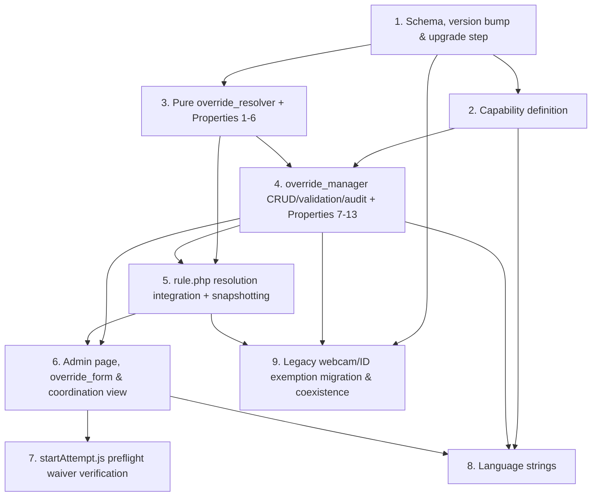

# Implementation Plan: Per-Student Proctoring Overrides

## Overview

This plan implements the per-student proctoring override layer for `quizaccess_proctoring` as an
incremental, test-driven sequence. It starts with the persistence layer (new tables, version bump,
upgrade step) and the capability, then builds the pure `override_resolver` (property-tested in
isolation, no DB), then the `override_manager` write/validation/audit layer (property- and
example-tested against the Moodle test DB), then wires resolution into `rule.php` at the preflight
config-assembly point. The reviewer admin page and `moodleform`, the coordination view, and the
`startAttempt.js` client verification follow, ending with language strings and the legacy
webcam/ID exemption migration. Each step builds on the previous one so there is no orphaned code.

All property tests are implemented as PHPUnit tests using a seeded bounded input generator running
at least 100 iterations per property, each tagged with a comment in the form
`// Feature: per-student-proctoring-overrides, Property N: <text>`, per the design's Testing
Strategy.

## Task Ordering Overview



## Tasks

- [x] 1. Create persistence layer, version bump, and upgrade step
  - [x] 1.1 Add the two new tables to `db/install.xml`
    - Add `quizaccess_proctoring_overrides` with all fields (`courseid`, `quizid`, `userid`, the
      five tri-state `*state` columns defaulting to `-1`, `justification` text, nullable `expiry`,
      `revoked`, `revokedby`, `timerevoked`, `grantedby`, `timecreated`, `timemodified`) and
      indexes `coursequizuser`, `useridcourse`, `revoked`, matching the XMLDB in the design
    - Add `quizaccess_proctoring_override_audit` (`overrideid`, `actorid`, `action`, `fieldname`,
      `oldvalue`, `newvalue`, `timecreated`) with indexes `overrideid` and `actorid`
    - Update the `<XMLDB ... VERSION="...">` attribute in `install.xml` to `2026062406`
    - _Requirements: 1.1, 6.1, 7.5, 7.6, 8.1_
  - [x] 1.2 Bump the plugin version in `version.php`
    - Change `$plugin->version` from `2026062405` to `2026062406`
    - _Requirements: 1.1_
  - [x] 1.3 Add the upgrade step in `db/upgrade.php`
    - Add an `if ($oldversion < 2026062406)` block that creates both tables via
      `$dbman->create_table()` guarded by `!$dbman->table_exists()`, then calls
      `upgrade_plugin_savepoint(true, 2026062406, 'quizaccess', 'proctoring')`
    - _Requirements: 1.1_
  - [x] 1.4 Write an integration test for the upgrade step
    - Assert both tables are created idempotently (guarded by `table_exists`) and that
      `version.php` and the `install.xml` VERSION attribute agree
    - _Requirements: 1.1_

- [x] 2. Define the `manageoverrides` capability
  - [x] 2.1 Add `quizaccess/proctoring:manageoverrides` to `db/access.php`
    - Define it as `CONTEXT_MODULE`, `captype => 'write'`, `riskbitmask => RISK_PERSONAL`, with
      `editingteacher` and `manager` archetypes set to `CAP_ALLOW`
    - _Requirements: 1.1, 1.2, 7.1, 7.2, 7.7, 9.3, 9.4_

- [x] 3. Implement the pure `override_resolver` and its property tests
  - [x] 3.1 Implement `classes/local/override_resolver.php`
    - Add the `REQ_*` requirement-key constants and `STATE_INHERIT/DISABLED/ENABLED` constants
    - Implement `apply_override()` (base + winner → effective bool), `pick_winner()` (scope
      specificity then recency tie-break, returning `STATE_INHERIT` when no non-inherit value
      applies), `applicable_overrides()` (scope match + not revoked + expiry null-or-`> now`,
      ordered for deterministic tie-break), and `resolve_all()` mapping all five `REQ_*` to
      effective booleans
    - _Requirements: 2.1, 2.2, 2.3, 2.4, 2.5, 2.6, 3.1, 3.2, 3.3, 3.4, 3.5, 1.5, 1.6, 4.1, 4.2, 4.3, 4.4, 5.4, 7.3, 8.2, 8.3_
  - [x] 3.2 Write property test: resolution matches the reference model
    - **Property 1: Resolution matches the reference model (site → quiz → override)**
    - Model-based: compare `override_resolver` against a small reference resolver over generated
      base states and override sets in `tests/override_resolver_test.php`
    - **Validates: Requirements 2.2, 2.3, 2.4, 2.6, 3.1, 3.2, 3.3, 3.4, 5.4**
  - [x] 3.3 Write property test: per-requirement independence
    - **Property 2: Per-requirement independence** in `tests/override_resolver_test.php`
    - **Validates: Requirements 2.1, 2.5**
  - [x] 3.4 Write property test: deterministic conflict tie-break
    - **Property 3: Deterministic conflict tie-break** (model-based) in
      `tests/override_resolver_test.php`
    - **Validates: Requirements 3.5**
  - [x] 3.5 Write property test: applicability gating (scope, revocation, expiry)
    - **Property 4: Applicability gating** in `tests/override_resolver_test.php`
    - **Validates: Requirements 1.5, 1.6, 7.3, 8.2, 8.3**
  - [x] 3.6 Write property test: isolation outside scope
    - **Property 5: Isolation outside scope** in `tests/override_resolver_test.php`
    - **Validates: Requirements 4.1, 4.2, 4.3, 4.4**
  - [x] 3.7 Write property test: effective state maps to the client requirement flag
    - **Property 6: Effective state maps to the client requirement flag** in
      `tests/override_resolver_test.php`
    - **Validates: Requirements 5.1, 5.4**

- [x] 4. Implement the `override_manager` write/validation/audit layer and its tests
  - [x] 4.1 Implement validation helpers in `classes/local/override_manager.php`
    - Implement `validate_target_student()` (exactly one existing enrolled user), `validate_states()`
      (each state in `{-1,0,1}`, atomic reject), `validate_justification()` (non-blank after trim,
      ≤ 2000 chars), and `validate_expiry()` (strictly `> now`), each throwing the corresponding
      `moodle_exception` error identifier from the design's Error Handling table
    - _Requirements: 1.3, 1.4, 2.7, 6.2, 8.4_
  - [x] 4.2 Implement `create()`, `edit()`, `revoke()` with capability checks, transactions, and audit
    - `create()` requires `manageoverrides`, validates, inserts the override, and appends a
      `create` audit row inside a DB transaction; returns the override id
    - `edit()`/`revoke()` require `manageoverrides`, reload inside a transaction, compute field
      diffs, write override changes plus audit rows atomically, preserve immutable `grantedby` /
      `timecreated`, and throw `error:overridenotfound` for a missing id
    - Implement the private append-only `audit()` (insert-only; one row per changed field on edit,
      single row for create/revoke)
    - _Requirements: 1.1, 1.2, 6.1, 6.4, 7.1, 7.2, 7.5, 7.6, 7.7, 8.1_
  - [x] 4.3 Write property test: invalid state assignment is atomic and rejected
    - **Property 7: Invalid state assignment is atomic and rejected** in
      `tests/override_manager_test.php`
    - **Validates: Requirements 2.7**
  - [x] 4.4 Write property test: justification validation
    - **Property 8: Justification validation** (boundary lengths 0/1/2000/2001, whitespace) in
      `tests/override_manager_test.php`
    - **Validates: Requirements 6.2**
  - [x] 4.5 Write property test: expiry must be in the future
    - **Property 9: Expiry must be in the future** in `tests/override_manager_test.php`
    - **Validates: Requirements 8.4**
  - [x] 4.6 Write property test: create/read round-trip
    - **Property 10: Create/read round-trip** in `tests/override_manager_test.php`
    - **Validates: Requirements 6.3, 8.1**
  - [x] 4.7 Write property test: immutable creation fields
    - **Property 11: Immutable creation fields** (`grantedby`, `timecreated`) in
      `tests/override_manager_test.php`
    - **Validates: Requirements 6.4**
  - [x] 4.8 Write property test: edit audit captures per-field before/after
    - **Property 12: Edit audit captures per-field before/after** in
      `tests/override_manager_test.php`
    - **Validates: Requirements 7.5**
  - [x] 4.9 Write property test: audit trail is append-only and monotonic
    - **Property 13: Audit trail is append-only and monotonic** in
      `tests/override_manager_test.php`
    - **Validates: Requirements 7.6**
  - [x] 4.10 Write example/unit tests for capability gating and recordkeeping
    - Create/edit/revoke/view allowed with `manageoverrides`, denied without, and denial appends
      no audit row; target validation edge cases (zero, non-existent, non-enrolled user); created
      override exposes all recorded fields on review
    - _Requirements: 1.1, 1.2, 1.3, 1.4, 6.1, 6.3, 7.1, 7.2, 7.7_

- [x] 5. Checkpoint - Ensure resolver and manager tests pass
  - Ensure all tests pass, ask the user if questions arise.

- [x] 6. Integrate override resolution into `rule.php`
  - [x] 6.1 Call `override_resolver::resolve_all()` at the preflight config-assembly point
    - In `add_preflight_check_form_fields()`, compute the five base states from the existing
      helpers (`requires_entire_screen`, `requires_captcha`, `site_requires_id_verification`, the
      `faceidcheck`/`registerface` path, `multi_monitor_mode`), pass them and
      `{courseid, quizid, userid, now}` to `resolve_all()`, and write the resolved booleans into
      the config `$record` handed to `startAttempt.js` (a disabled `multimonitorstate` forces
      `MULTI_MONITOR_OFF`)
    - Ensure resolution runs only at the new-attempt gate (`$attemptid` empty) so in-progress
      attempts keep their start-time state
    - _Requirements: 3.1, 3.2, 3.3, 5.1, 5.4, 7.3, 7.4, 8.2, 8.3_
  - [x] 6.2 Write example tests for rule.php resolution and in-progress snapshotting
    - Base states with no override match today's behavior; a non-inherit override changes the
      config flag; resolve at start then revoke and confirm the started attempt is not re-resolved
    - _Requirements: 3.1, 3.3, 7.4_

- [x] 7. Build the reviewer admin page, form, and coordination view
  - [x] 7.1 Implement `classes/form/override_form.php`
    - `moodleform` with target-student selector (enrolled users in the course context), optional
      quiz selector, five tri-state selects defaulting to inherit, optional `date_time_selector`
      expiry, and a required justification textarea; server-side `validation()` duplicates the
      `override_manager` checks and surfaces field-level errors
    - _Requirements: 1.3, 2.1, 2.5, 2.6, 2.7, 6.1, 6.2, 8.1, 8.4_
  - [x] 7.2 Implement `manage_overrides.php` admin page with create/edit/revoke actions
    - `require_login` + `require_capability('quizaccess/proctoring:manageoverrides', $context)`;
      render `override_form` for create/edit and a confirmed POST revoke action, delegating all
      writes to `override_manager`
    - _Requirements: 1.1, 1.2, 7.1, 7.2, 7.7, 9.3, 9.4_
  - [x] 7.3 Implement the coordination view on `manage_overrides.php`
    - List overrides applicable to the quiz with target student, affected requirements and their
      states; show a "native quiz override exists" indicator read from core `quiz_overrides` for
      the same student+quiz
    - _Requirements: 6.3, 9.1, 9.2, 9.3, 9.4_
  - [x] 7.4 Write example tests for the coordination view
    - Rows list student + affected requirements + states; native-quiz-override indicator appears
      iff a `quiz_overrides` row exists for the same student+quiz; view denied without capability
    - _Requirements: 9.1, 9.2, 9.4_

- [x] 8. Verify and wire `amd/src/startAttempt.js` for waived requirements
  - [x] 8.1 Confirm each of the five Pre_Check steps is guarded solely by its config flag
    - Verify CAPTCHA/Turnstile, webcam (`faceidcheck`/`registerface`), ID verification,
      entire-screen, and multi-monitor steps are each included only when their config flag is on,
      so a waived flag cleanly omits the step and `updatePreflightGate()` does not await it,
      including the all-waived case where Start is reachable after privacy/honor
    - _Requirements: 5.1, 5.2, 5.3, 5.5_
  - [x] 8.2 Write JS tests for waived-step omission
    - A disabled requirement flag omits its Pre_Check step and the gate advances to the next
      enabled step with no error referencing the omitted step; a waived CAPTCHA/Turnstile is
      skipped and Start becomes enabled; all-waived case reaches Start
    - _Requirements: 5.2, 5.3, 5.5_

- [x] 9. Add language strings
  - [x] 9.1 Add strings to `lang/en/quizaccess_proctoring.php`
    - Capability string `proctoring:manageoverrides`; form field labels/help (target, quiz, five
      requirement states, expiry, justification); coordination view strings (including native
      quiz override indicator); and the error identifiers from the design's Error Handling table
      (`error:invalidtarget`, `error:invalidstate`, `error:invalidjustification`,
      `error:expiryinpast`, `error:overridenotfound`)
    - _Requirements: 1.2, 1.4, 2.7, 6.2, 8.4, 9.1, 9.2_

- [x] 10. Migrate and subsume the legacy webcam/ID exemption
  - [x] 10.1 Add a conditional migration to `db/upgrade.php` and stop consulting the old path
    - If the `proctoring-feedback-improvements` webcam/ID exemption mechanism shipped its own
      storage, migrate existing exemptions into override rows (`webcamstate`/`idverificationstate`
      = `0`, carrying over `grantedby`/`timecreated`, synthetic migration justification) inside the
      upgrade step, then remove the old exemption consultation from `rule.php`; if it did not ship,
      make `quizaccess_proctoring_overrides` the single source of truth with no data migration
    - _Requirements: 3.1, 3.2_
  - [x] 10.2 Write migration tests
    - Verify migration of 1–2 representative legacy exemptions into equivalent override rows and
      that `rule.php` no longer consults the old path
    - _Requirements: 3.1, 3.2_

- [x] 11. Final checkpoint - Ensure all tests pass
  - Ensure all tests pass, ask the user if questions arise.

## Notes

- Tasks marked with `*` are optional test sub-tasks and can be skipped for a faster MVP; core
  implementation tasks are never marked optional.
- Property tests use a seeded bounded generator (≥100 iterations) and are tagged with
  `// Feature: per-student-proctoring-overrides, Property N: <text>`.
- Property-to-test-class mapping matches the design: `override_resolver_test.php` covers Properties
  1–6; `override_manager_test.php` covers Properties 7–13.
- Each task references specific requirement sub-clauses for traceability; every requirement (1–9)
  and every design Property (1–13) is covered by at least one task.

## Task Dependency Graph

```json
{
  "waves": [
    { "id": 0, "tasks": ["1.1", "1.2", "1.3"] },
    { "id": 1, "tasks": ["1.4", "2.1", "3.1"] },
    { "id": 2, "tasks": ["3.2", "3.3", "3.4", "3.5", "3.6", "3.7", "4.1"] },
    { "id": 3, "tasks": ["4.2"] },
    { "id": 4, "tasks": ["4.3", "4.4", "4.5", "4.6", "4.7", "4.8", "4.9", "4.10", "6.1"] },
    { "id": 5, "tasks": ["6.2", "7.1"] },
    { "id": 6, "tasks": ["7.2"] },
    { "id": 7, "tasks": ["7.3", "8.1", "9.1", "10.1"] },
    { "id": 8, "tasks": ["7.4", "8.2", "10.2"] }
  ]
}
```
