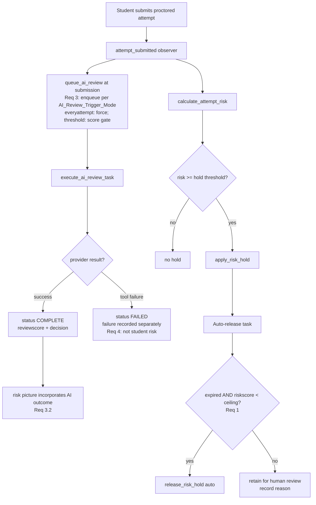
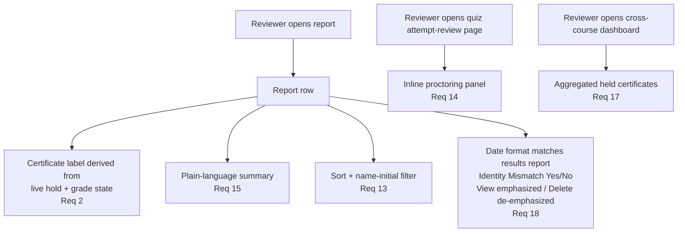

# Design Document

## Overview

This design translates the P0 and P2 requirement groups of the `proctoring-feedback-improvements`
spec into concrete, code-level changes for the `quizaccess_proctoring` Moodle quiz access plugin.
It builds directly on the plugin's existing risk-hold, AI-review, risk-scoring, and reporting code
rather than introducing parallel machinery.

The design corrects behaviors that are currently incorrect or misleading to the Student Affairs
review team:

- **P0 (Requirements 1–6)** — Risk-Ceiling Gate on Auto-Release; Certificate Label and State
  Consistency; Automatic AI Image Review at Submission; Distinguish Tool Failure From Student
  Risk; Certificate Date Reflects Exam Completion; Camera Lifecycle Scoped to Pre-Check.
- **P2 (Requirements 13–18)** — Sortable and Filterable Report; Inline Attempt-Review
  Integration; Plain-Language Session Summary; Documented and Reconciled Risk-Scoring Model;
  Cross-Course Held-Certificate Dashboard; Small Report Fixes.

### Scope

**This design addresses P0 and P2 only.** The P1 (operability), P3 (in-exam posture and
detection), and P4 (content, copy, and tutorial) requirement groups are explicitly **deferred to
a later design pass** and are not designed here. Where a P0/P2 change touches a surface that P1
will later extend (for example, the inline hold-decision controls of Requirement 7, or the durable
certificate-status store of Requirement 8), this design notes the seam but does not implement the
deferred requirement.

A small number of items the P0/P2 requirements depend on are leadership/policy decisions recorded
in the requirements document's "Assumptions and Dependencies" section. The most important is the
**Risk_Ceiling value** that feeds Requirement 1. This design makes the ceiling a configurable
setting and ships a safe default; choosing the operational value remains a leadership decision.

### Design Principles

1. **Reuse existing primitives.** The `quizaccess_proctoring_risk_holds` table already carries a
   `riskscore` column, `quizaccess_proctoring_ai_reviews` already carries a `status` and
   `decision`, and `quizaccess_proctoring_release_risk_hold()` /
   `quizaccess_proctoring_confirm_risk_hold()` already exist. P0/P2 changes gate and surface these,
   they do not replace them.
2. **Fail toward human review, not away from it.** The current auto-release is fail-open (it
   releases every expired hold). The corrected behavior retains high-risk holds so a human decides.
3. **Keep tool failures out of the student's risk picture.** A vision-provider error must never be
   presented or counted as student misconduct.
4. **Follow Moodle plugin conventions.** New settings go through `settings.php` and `get_config()`;
   schema changes go through `db/install.xml` + `db/upgrade.php` with a bumped `version.php`; UI is
   rendered through Mustache templates and `get_string()`; scheduled behavior stays in
   `classes/task/`.

## Architecture

### Current relevant components

| Component | File | Responsibility |
|-----------|------|----------------|
| Submission observer | `classes/proctoring_observer.php` | On `attempt_submitted`, computes risk, applies a hold, and conditionally queues AI review. |
| Risk calculator | `classes/local/risk_calculator.php` + `lib.php` wrappers | Computes a 0–100 risk score from weighted event factors. |
| Risk hold lifecycle | `lib.php` (`apply`/`release`/`auto_release`/`confirm`) | Applies/releases grade holds; the hold gates grade-based certificate release. |
| Auto-release task | `classes/task/release_expired_risk_holds_task.php` | Hourly; calls `quizaccess_proctoring_auto_release_expired_risk_holds()`. |
| AI review task | `classes/task/execute_ai_review_task.php` | Every 5 min; processes `QUEUED` AI reviews. |
| Per-quiz report | `report.php` + `templates/report.mustache` | Per-student proctoring report with risk score, hold status, AI review, images. |
| Site-wide report | `classes/local/overall_report.php` + `overall_reports.php` | Cross-course aggregate report with filters and inline hold actions. |
| Settings | `settings.php` + `lang/en/quizaccess_proctoring.php` | Admin configuration. |

### Data flow after this design (P0 focus)





## Components and Interfaces

The subsections below are organized by requirement. Each names the files touched and the
function/interface changes, and traces back to the acceptance criteria it satisfies.

### C1. Risk-Ceiling Gate on Auto-Release (Requirement 1)

**Problem.** `quizaccess_proctoring_auto_release_expired_risk_holds()` selects every `ACTIVE` hold
whose `timecreated` is older than the review window and releases it. Risk score is ignored, so the
most suspicious attempts are auto-cleared by the timer — the opposite of the intended behavior.

**New setting.** Add a site setting `quizaccess_proctoring/riskreviewceiling` (integer 0–101) with
an accessor:

```php
/**
 * Risk score at or above which an expired hold is retained for human review instead of auto-released.
 * A value of 101 (or >100) disables the ceiling: all expired holds auto-release (prior behavior).
 *
 * @return int Ceiling from 0 to 101.
 */
function quizaccess_proctoring_get_risk_review_ceiling(): int;
```

Default value ships as `101` (ceiling disabled → preserves prior behavior) so the schema/setting
change is inert until leadership sets an operational value. **Requirement 1.4** is satisfied by the
"permits all scores" sentinel.

**Gated query.** Modify `quizaccess_proctoring_auto_release_expired_risk_holds()` to add the score
predicate to the SQL selection:

```php
$ceiling = quizaccess_proctoring_get_risk_review_ceiling();
// ... existing status + cutoff predicate, plus:
'AND riskscore < :ceiling'   // only when $ceiling <= 100; when disabled, omit the predicate.
```

Holds with `riskscore >= ceiling` are never selected, so they remain `ACTIVE` and available for
inline release/confirm in the report (**Requirements 1.2, 1.3**).

**Recording the retention reason (Requirement 1.5).** Retained holds must record why they were not
auto-released. Because auto-release is a query-time exclusion, add a lightweight, idempotent
"annotation" pass in the task: after selecting releasable holds, also select expired active holds
with `riskscore >= ceiling` that have not yet been annotated, and record the reason. Store the
reason on the hold via a new nullable column `autoreleaseblockedreason` (char) and
`autoreleaseblockedscore` (int) — see Data Models. The annotation is written once per hold
(guarded by `autoreleaseblockedreason IS NULL OR ''`) so repeated task runs are idempotent.

Files: `lib.php`, `classes/task/release_expired_risk_holds_task.php` (mtrace both counts),
`settings.php`, `lang/en/quizaccess_proctoring.php`, `db/install.xml`, `db/upgrade.php`,
`version.php`.

### C2. Certificate Label and State Consistency (Requirement 2)

**Problem.** The report shows a static hold-status label (`riskreview:active` = "Review required –
grade/certificate held"). The plugin holds the **grade**, and certificate release is grade-based
(the certificate module issues on grade). After a hold is released or a grade otherwise exists, the
report can still show a "held" label because the label is derived only from the hold row and not
reconciled with the actual grade/certificate state.

**Design.** Introduce a single source of truth for the displayed certificate label:

```php
/**
 * Resolve the certificate label for an attempt from live state, not a stale hold row.
 *
 * @return array{state:string,label:string,class:string}
 *   state is one of 'held' | 'released' | 'issued' | 'none'.
 */
function quizaccess_proctoring_resolve_certificate_label(
    int $courseid, int $cmid, int $userid, int $attemptid, int $reportid): array;
```

Resolution rules (evaluated in order):

1. If an active hold exists (`status = ACTIVE`) → `held`.
2. Else if a released/confirmed hold exists → reflect that decision (`released` restores grade;
   `confirmed` keeps withheld).
3. Else, reconcile against the gradebook: if a non-null quiz grade exists for the user, the
   certificate is treated as `issued`/eligible and **must not** show a "withheld" label
   (**Requirement 2.2**).
4. Otherwise `none`.

Both `report.php` and `overall_report.php` call this resolver instead of
`quizaccess_proctoring_get_risk_hold_status_label()` directly for the certificate column. Because
the label is derived on each render from the current hold + grade state, a state change is reflected
on the next view (**Requirements 2.1, 2.3**).

Files: `lib.php`, `report.php`, `classes/local/overall_report.php`, templates, language strings.

### C3. Automatic AI Image Review at Submission (Requirement 3)

**Problem.** In `proctoring_observer::handle_quiz_attempt_submitted()`, AI review is only queued
when `risk >= aireviewsettings['triggerthreshold']`. Below that threshold the report shows "Not
queued", and reviewers must click a manual "Analyze images" action, so the displayed score is not
the true score at review time. At the same time, always enqueuing for every attempt does not suit
every institution's review capacity, so the enqueue behavior must be **configurable** rather than
hard-coded either way.

**Design.**

1. **Configurable trigger mode drives the enqueue decision (Requirement 3.1).** Add a site setting
   `quizaccess_proctoring/aireviewtriggermode` (enum `everyattempt` | `threshold`) with an accessor:

   ```php
   /**
    * The configured AI-review trigger mode selecting when AI image review is enqueued at submission.
    *
    * @return string One of 'everyattempt' or 'threshold'. Defaults to 'threshold' (prior behavior).
    */
   function quizaccess_proctoring_get_ai_review_trigger_mode(): string;
   ```

   The observer reads this mode and chooses whether to enqueue at submission. In **both** modes the
   enqueue is still guarded by `quizaccess_proctoring_ai_review_configured()` (AI review must be
   configured and enabled).

2. **Mode-selected enqueue at submission.** `quizaccess_proctoring_queue_ai_review()` currently
   early-returns when `riskscore < triggerthreshold`. Add a `$force = false` parameter whose default
   preserves this threshold gate. The observer selects behavior by the configured mode:

   - **`everyattempt` mode** — the observer calls
     `quizaccess_proctoring_queue_ai_review(..., $force = true)`, which bypasses the internal
     `riskscore < triggerthreshold` early-return, so AI review is enqueued for every proctored
     attempt regardless of the risk score (**Requirement 3.2**).
   - **`threshold` mode** — the observer calls `quizaccess_proctoring_queue_ai_review(...)` with
     `$force = false` (the default), retaining the existing threshold gate: the review is enqueued
     only when the attempt's risk score is at or above the AI-review trigger threshold
     (**Requirement 3.3**), and is left not enqueued when the score is below the threshold
     (**Requirement 3.4**).

   The trigger-threshold value is still retained on the row for reporting in both modes; it only
   gates enqueue in `threshold` mode.

3. **Pending status, not "Not queued" (Requirement 3.6).** Whenever a row is inserted with status
   `QUEUED` (every attempt in `everyattempt` mode; qualifying attempts in `threshold` mode), the
   report's AI column renders "queued/processing" via the existing
   `quizaccess_proctoring_get_ai_review_status_label()` path. The "Not queued" string is only shown
   when no row exists — i.e. in `threshold` mode for below-threshold attempts that have never been
   enqueued.

4. **Incorporate result into the risk picture without a manual action (Requirements 3.5, 3.7).**
   After the task completes, the report already reads the AI review via
   `quizaccess_proctoring_get_ai_review()` and formats it with
   `quizaccess_proctoring_format_ai_review_for_template()`. The presented risk picture combines the
   calculator score with the completed AI outcome and displays the resulting score as current
   without a manual action.

5. **Manual re-run affordance retained (Requirement 3.8).** The manual "Analyze images" control
   remains available as a re-run affordance regardless of the configured trigger mode (including for
   below-threshold attempts in `threshold` mode that were never auto-enqueued).

Files: `classes/proctoring_observer.php`, `lib.php`
(`quizaccess_proctoring_queue_ai_review` signature + `$force` parameter,
`quizaccess_proctoring_get_ai_review_trigger_mode` accessor), `settings.php`,
`lang/en/quizaccess_proctoring.php`, `report.php`/templates for status wording.

### C4. Distinguish Tool Failure From Student Risk (Requirement 4)

**Problem.** A `FAILED` AI review (provider/API error) can be visually conflated with an adverse
student signal, and there is a risk that a failure influences withholding.

**Design.**

1. **Separate presentation.** `quizaccess_proctoring_format_ai_review_for_template()` returns
   distinct flags for `isfailed` vs `isflagged`. The report template renders a **neutral "tool
   could not complete" indicator** for `FAILED` (status class `proctoring-ai-toolfailure`), visually
   separated from student-risk badges (**Requirement 4.1**).
2. **Never withhold on tool failure alone (Requirement 4.2).** The hold decision in the observer is
   driven solely by the calculator risk score vs the hold threshold; the AI review outcome does not
   add to that score. Document and assert that a `FAILED` AI review contributes **zero** to the risk
   score and cannot, by itself, create or sustain a hold. The certificate-label resolver (C2) treats
   a tool failure as `none` for the AI dimension.
3. **Record failures separately (Requirement 4.3).** Tool failures are already stored on the AI
   review row as `status = FAILED` with `errormessage`, which is a separate field from any
   student-risk signal. This design formalizes that separation: student risk lives in
   `quizaccess_proctoring_events` + the calculator; tool failures live in the AI review row's
   `status`/`errormessage`. No student-risk event is ever written for a provider error.

Files: `lib.php` (`format_ai_review_for_template`), `report.php`,
`classes/local/overall_report.php`, templates, language strings.

### C5. Certificate Date Reflects Exam Completion (Requirement 5)

**Problem.** When a hold is released and the grade is restored, `quiz_grade_item_update()` /
`quiz_update_grades()` are called at release time. If the certificate module issues based on the
grade's `dategraded`/timemodified, the certificate date becomes the release date, not the exam
completion date.

**Design.** When releasing a hold, backdate the restored grade's `dategraded` to the attempt
completion time so downstream grade-based certificate issuance reflects exam completion.

- In `quizaccess_proctoring_release_risk_hold()`, after `quiz_update_grades()`, fetch the attempt's
  `timefinish` (`quiz_attempts.timefinish`, falling back to the hold's `reportid` log timemodified
  when the attempt row is unavailable) and explicitly set the grade item's `dategraded` to that
  timestamp via `quiz_grade_item_update()` with a `dategraded` override.
- The backdating is unconditional with respect to the delay between completion and release: the
  completion date is used regardless of how long the hold lasted (**Requirements 5.1, 5.2**).
- Provide a small pure helper so the date choice is unit/property testable:

```php
/**
 * Choose the certificate/grade date for a released hold: always the exam completion date.
 *
 * @param int $timefinish Attempt completion time (unix ts), or 0 when unknown.
 * @param int $fallback   Fallback completion time (e.g. report timemodified), or 0.
 * @return int Chosen date (unix ts).
 */
function quizaccess_proctoring_certificate_date_for_release(int $timefinish, int $fallback): int;
```

Files: `lib.php` (`release_risk_hold`, new helper).

### C6. Camera Lifecycle Scoped to Pre-Check (Requirement 6)

**Problem.** The webcam is requested via `requestUserCamera()` in `proctoring.js`. The camera must
not turn on before the Pre-Check modal is opened, must initialize inside the modal, and must be torn
down when the student aborts/exits/navigates away.

**Design (client-side, `amd/src/proctoring.js` and the pre-check modal controller).**

1. **No pre-modal activation (Requirement 6.1).** Remove/guard any `requestUserCamera()` call that
   runs on activity page load. Camera acquisition is only invoked from the Pre-Check modal's "open"
   handler.
2. **Initialize within the modal (Requirement 6.2).** Move the `getUserMedia` acquisition into the
   modal `shown`/open callback; bind the resulting `MediaStream` to the modal's `<video>` element and
   track it in a module-scoped `precheckStream` handle.
3. **Deterministic teardown (Requirement 6.3).** Add a single `teardownPrecheckCamera()` that stops
   every track (`stream.getTracks().forEach(t => t.stop())`), nulls `video.srcObject`, and clears
   `precheckStream` / `isCameraAllowed`. Wire it to: modal `hidden`/cancel, the abort/exit control,
   and `beforeunload`/`pagehide` for navigation-away. This mirrors the existing
   `stopIdDocumentStream()` / `stopIdLiveStream()` teardown pattern already used in
   `startAttempt.js`, keeping the approach consistent across the plugin.

Because this is browser lifecycle/DOM behavior (not a pure function over a large input space), it is
verified by example-based/interaction tests (see Testing Strategy), not property-based tests.

Files: `amd/src/proctoring.js` (rebuild to `amd/build/`), pre-check template/modal wiring.

### C7. Sortable and Filterable Report (Requirement 13)

**Problem.** The per-quiz report has a text search but no default newest-first ordering, no
column sort, and no first/last-name initial filter.

**Design.**

1. **Default newest-first (Requirement 13.1).** The report query orders by attempt/most-recent
   activity descending by default. `overall_report.php` already supports a `recent` sort; the
   per-quiz `report.php` ordering is set to newest-first as the default `ORDER BY timemodified DESC`.
2. **Sort by column (Requirement 13.2).** Add a `sort` + `dir` request param handled server-side,
   with a whitelist of sortable columns (name, date, risk score, violations). A pure helper maps
   `(sort, dir)` to a safe `ORDER BY` fragment from a fixed allowlist (no user SQL):

```php
/**
 * Map a requested sort key and direction to a safe ORDER BY fragment.
 *
 * @param string $sort Requested column key.
 * @param string $dir 'asc' or 'desc'.
 * @return string Safe ORDER BY fragment (defaults to newest-first when unknown).
 */
function quizaccess_proctoring_report_order_by(string $sort, string $dir): string;
```

3. **Name-initial filter (Requirement 13.3).** Add first-name and last-name initial filters
   (A–Z + "all"), reusing Moodle's `\core_user\output\myprofile` initial-bar idiom or a simple
   `firstnameinitial`/`lastnameinitial` param translated to `firstname LIKE 'A%'` predicates. A pure
   predicate helper decides membership for testability:

```php
/**
 * Whether a name matches the selected first/last initial filter.
 *
 * @param string $firstname
 * @param string $lastname
 * @param string $firstinitial Selected initial or '' for all.
 * @param string $lastinitial Selected initial or '' for all.
 * @return bool
 */
function quizaccess_proctoring_name_matches_initials(
    string $firstname, string $lastname, string $firstinitial, string $lastinitial): bool;
```

Files: `report.php`, `templates/report.mustache`, `lib.php` (helpers), language strings.

### C8. Inline Attempt-Review Integration (Requirement 14)

**Problem.** Reviewers must open the proctoring report separately from the quiz attempt-review page.

**Design.** Render the proctoring summary for an attempt inline on the quiz attempt-review page.
Moodle exposes the `mod_quiz\quiz_attempt` review view; the plugin's access rule
(`quizaccess_proctoring` rule class) can contribute output through the access-rule hooks, or a
renderer callback keyed on the review page. The chosen seam:

- Add a renderer/hook that, given `(courseid, cmid, userid, attemptid)`, builds the same
  template context used by `report.php`'s per-attempt panel (risk score, hold/certificate label, AI
  review status, plain-language summary) and returns it as an embeddable fragment
  (**Requirements 14.1, 14.2**).
- Guard visibility with the existing `quizaccess/proctoring:reviewriskholds` /
  report-access capabilities so only authorized reviewers see the inline panel.

The inline panel is a **read/summary** surface in this pass. Inline **decision controls**
(release/confirm/notes) belong to Requirement 7 (P1) and are deferred; the panel links out to the
existing report action affordances for now.

Files: a new renderer method + a hook/callback into the attempt-review page, reusing the existing
per-attempt template partial extracted from `report.php`.

### C9. Plain-Language Session Summary (Requirement 15)

**Problem.** Reviewers see raw telemetry (e.g., "viewportheight 715") and long repeated flag lists.

**Design.** Add a pure summary generator that turns the calculator's factor breakdown into 1–3
plain sentences:

```php
/**
 * Build a 1–3 sentence plain-language summary from risk factors and AI outcome.
 *
 * @param array $risk Result of quizaccess_proctoring_calculate_attempt_risk().
 * @param stdClass|false $aireview AI review row or false.
 * @return string One to three sentences; empty string only when there is genuinely nothing to report.
 */
function quizaccess_proctoring_build_session_summary(array $risk, $aireview): string;
```

Behavior:

- Selects the top contributing factors (those with `haspoints`), phrases each in plain language
  (e.g., "left the exam tab 3 times", "face not detected in 2 captures"), and joins into at most
  three sentences (**Requirement 15.1**).
- Raw telemetry key/value dumps are excluded from the default view; they remain available only in a
  collapsed "raw details" disclosure (**Requirement 15.2**).
- When a factor's evidence count is high, it is summarized as a count ("... 14 times") rather than
  listing each occurrence, collapsing repeated flags by default (**Requirement 15.3**).

Files: `lib.php` (or `classes/local/session_summary.php`), `report.php`, templates, language
strings.

### C10. Documented and Reconciled Risk-Scoring Model (Requirement 16)

**Problem.** The scoring model is undocumented, and reviewers observed inconsistencies (a high
suspicious-event count producing a low score; a maximal score when AI review found nothing).

**Design.**

1. **Documentation (Requirement 16.1).** Add a "Risk-Scoring Model" reference documenting every
   factor, its per-event points, and its cap, mirroring `risk_calculator::calculate_attempt()`.
   The canonical table (from the current code) is:

   | Factor | Points/event | Cap |
   |--------|-------------:|----:|
   | Face mismatch | 35 | 35 |
   | Multiple faces | 30 | 30 |
   | No face (images/events) | 8 | 24 |
   | Screen-share issues | 18 | 36 |
   | Multiple monitors | 25 | 25 |
   | Possible AI tool | 20 | 30 |
   | AI tool w/ screenshot | 15 | 30 |
   | Clipboard/context menu | 8 | 24 |
   | Tab/focus activity | 5 | 20 |
   | F12 | 15 | 15 |
   | Audio | 6 | 18 |
   | Webcam missing | 15 | 15 |
   | Speed (optional) | 25 | 25 |

   The total is summed then clamped to 100.

2. **Reconciliation (Requirement 16.2).** Two invariants must hold and are enforced/asserted:
   - *Monotonicity in suspicious evidence.* Adding suspicious events (holding all else equal) must
     not **decrease** the score. This addresses "a high suspicious-event count produces a low score".
     The current `build_factor()` is monotonic per factor (`min(cap, count*points)`), and the total
     is a non-negative sum; the reconciliation makes this an explicit, tested property and audits
     that every event type counted as a violation in `overall_report::SUSPICIOUS_EVENT_TYPES` maps
     to a scoring factor (no "counts as violation but scores nothing" gaps).
   - *AI review does not inflate the score.* Because AI review outcome is **not** a scoring factor,
     a "nothing found" AI result cannot raise the score, and (with C4) a tool failure cannot either.
     This addresses "a maximal score when AI review finds nothing": the score is a function of
     student-attributable events only, so the AI dimension is reported alongside but never summed in.

   No factor weights are changed in this pass unless the audit finds a violation-but-unscored event
   type; if found, the fix is to add the missing factor (documented in the reconciliation note).

Files: documentation in the design + a doc block in `risk_calculator.php`; a reconciliation audit
covered by tests. Behavior changes only if the audit finds a gap.

### C11. Cross-Course Held-Certificate Dashboard (Requirement 17)

**Problem.** Held certificates are only visible per-course.

**Design.** Extend the existing site-wide `overall_report` machinery (which already aggregates
across all courses and counts active holds) with a **held-certificate view** that lists every
attempt whose certificate label resolves to `held` (via C2's resolver), across all courses
(**Requirement 17.1**). Because the label is derived live from the hold + grade state on each
render, the dashboard reflects the current state whenever a hold is created or its status changes in
any course (**Requirement 17.2**).

Implementation: add a `held_certificates()` builder in `classes/local/overall_report.php` (or a
sibling `held_certificate_dashboard.php`) that selects holds with `status = ACTIVE` across all
courses, decorates each with user/course/quiz names and the resolved certificate label, and paginates
using the existing `PER_PAGE`/`MAX_ATTEMPTS` bounds. Surface it via `overall_reports.php` with a view
toggle, guarded by the system-context review capability.

Files: `classes/local/overall_report.php` (new builder), `overall_reports.php`, templates, language
strings.

### C12. Small Report Fixes (Requirement 18)

Targeted fixes in `report.php` + `templates/report.mustache`:

1. **Date/time format matches the results report (Requirement 18.1).** Replace
   `date('Y/M/d H:i:s', $info->timemodified)` in `report.php` with Moodle's `userdate()` using the
   same format the quiz results report uses (locale/timezone aware), so proctoring and results
   reports agree.
2. **Identity Mismatch as Yes/No (Requirement 18.2).** Render the identity/name-mismatch column as a
   localized "Yes"/"No" derived from the mismatch flag, replacing any raw/blank value.
3. **De-emphasize Delete, emphasize View (Requirement 18.3).** In the row action area, present
   "View images" as the primary/emphasized action and move "Delete" into the de-emphasized/secondary
   position (e.g., View as a primary button, Delete as a muted link inside the kebab menu). This is a
   template + class change; the destructive `confirm()` guard is retained.
4. **Remove the "This can include…" line (Requirement 18.4).** Delete the non-actionable
   description string from the report template and its language string usage.

Files: `report.php`, `templates/report.mustache`, `lang/en/quizaccess_proctoring.php`.

## Data Models

### New site settings (`settings.php` + `get_config`)

| Setting key | Type | Default | Purpose | Requirement |
|-------------|------|---------|---------|-------------|
| `quizaccess_proctoring/riskreviewceiling` | int (0–101) | `101` (disabled) | Risk score at/above which expired holds are retained for human review. | 1.1, 1.4 |
| `quizaccess_proctoring/aireviewtriggermode` | enum (`everyattempt` \| `threshold`) | `threshold` (preserves current behavior) | Selects when AI image review is enqueued at submission: `everyattempt` enqueues for every proctored attempt (gated only on AI review being configured); `threshold` enqueues only when the risk score is at/above the AI-review trigger threshold. | 3.1 |

No new setting is required for Requirements 2 and 4–18 beyond language strings; they reuse existing
configuration. Report sort/filter selections (Requirement 13) are request parameters, not stored
settings.

### Schema changes (`db/install.xml` + `db/upgrade.php`, bump `version.php`)

Add two nullable columns to `quizaccess_proctoring_risk_holds` to record the auto-release retention
reason for ceiling-blocked holds (Requirement 1.5):

| Column | Type | Null | Default | Purpose |
|--------|------|------|---------|---------|
| `autoreleaseblockedscore` | int(10) | not null | `0` | Risk score at the time the hold was blocked from auto-release (0 = never blocked). |
| `autoreleaseblockedreason` | char(40) | null | `null` | Reason key, e.g. `riskceiling`. Null/empty = not blocked. |

These are additive and backward compatible; existing rows default to "not blocked". The idempotent
annotation pass (C1) only writes them once per hold.

### Existing tables and constants relied upon (unchanged)

- `quizaccess_proctoring_risk_holds`: `riskscore` (already present, drives the ceiling gate),
  `status` (`ACTIVE=0`, `RELEASED=1`, `CONFIRMED=2`), `timecreated`, `timereviewed`, `originalgrade`.
- `quizaccess_proctoring_ai_reviews`: `status` (`QUEUED=0`, `PROCESSING=1`, `COMPLETE=2`,
  `FAILED=3`), `decision`, `reviewscore`, `errormessage` (tool-failure detail, Req 4).
- `quizaccess_proctoring_events`: student-attributable signals scored by the calculator (Req 16).
- `quiz_attempts.timefinish`: exam completion date source for certificate backdating (Req 5).

### Certificate-state model (Requirement 2 / 17)

Certificate state is **derived**, not stored, in this pass (a durable, queryable certificate-status
store is Requirement 8 / P1, deferred). The derivation is the `resolve_certificate_label()` function
(C2), a pure function of `(active hold?, released/confirmed hold?, quiz grade present?)`:

```
held      := active hold exists
withheld  := confirmed hold exists (grade held at zero)
released  := released hold exists and grade restored
issued    := no active/confirmed hold AND a non-null quiz grade exists
none      := otherwise
```

This is the single mapping used by the per-quiz report, the inline attempt-review panel, and the
cross-course dashboard, guaranteeing they agree.

## Correctness Properties

*A property is a characteristic or behavior that should hold true across all valid executions of a
system — essentially, a formal statement about what the system should do. Properties serve as the
bridge between human-readable specifications and machine-verifiable correctness guarantees.*

The properties below were derived from the prework analysis of the P0/P2 acceptance criteria. Each
targets a pure or purifiable decision function so it can be exercised across many generated inputs.
UI/DOM lifecycle criteria (Requirement 6), rendering integrations (Requirements 14, 18.1/18.3/18.4),
documentation (16.1), and single-interaction behaviors (3.5/3.7/3.8, 4.3) are covered by
example-based/interaction tests in the Testing Strategy rather than as properties.

### Property 1: Auto-release ceiling gate

*For any* set of risk holds (each with a status, age, and risk score) and any configured
Risk_Ceiling, the auto-release selection releases a hold *if and only if* the hold is active, its
review window has expired, and its risk score is strictly below the ceiling; when the ceiling is
configured to permit all scores (greater than 100), every expired active hold is released.

**Validates: Requirements 1.2, 1.3, 1.4**

### Property 2: Ceiling-blocked holds record their retention reason

*For any* expired active hold whose risk score is at or above the Risk_Ceiling, after the
auto-release task runs the hold remains active and its retention annotation is recorded
(`autoreleaseblockedscore` equals the hold's risk score and `autoreleaseblockedreason` is set);
running the task again does not change the recorded annotation (idempotent).

**Validates: Requirements 1.5**

### Property 3: Certificate label reflects live state and never mislabels an issued certificate

*For any* combination of hold state (none / active / released / confirmed) and grade presence, the
certificate-label resolver returns the state dictated by the derivation table; in particular,
whenever a grade is present and no active or confirmed hold exists, the resolver never returns a
"held" or "withheld" label. Re-resolving after any state transition yields the label for the new
state.

**Validates: Requirements 2.1, 2.2, 2.3**

### Property 4: AI review status is never presented as "Not queued" once a row exists

*For any* AI review status value, the status label is the pending variant for queued or processing
reviews, the completed variant for complete reviews, and the tool-failure variant for failed
reviews; the "Not queued" presentation occurs only when no AI review row exists for the attempt.

**Validates: Requirements 3.6**

### Property 5: Tool failures are isolated from student risk

*For any* set of student events and any AI review outcome (including a tool failure), the computed
risk score equals the score computed while ignoring the AI outcome entirely; a failed AI review is
flagged as a tool failure (never as a student-risk signal) and, when it is the only adverse signal,
produces no grade/certificate hold.

**Validates: Requirements 4.1, 4.2, 4.3, 16.2**

### Property 6: Released certificate date is the exam completion date

*For any* exam completion time and *for any* delay between completion and release, the date chosen
for the released grade/certificate equals the exam completion time (or the defined fallback when the
completion time is unknown), independent of the release delay.

**Validates: Requirements 5.1, 5.2**

### Property 7: Report sorting orders rows by the selected column and defaults to newest-first

*For any* list of report rows and *for any* allowlisted sort column and direction, the sorted output
is ordered by that column in that direction; when no sort is selected (or an unknown column is
requested), the output is ordered newest-first.

**Validates: Requirements 13.1, 13.2**

### Property 8: Name-initial filter matches by initial

*For any* first name, last name, and selected first/last initial filters, a row is included *if and
only if* the first name starts with the selected first initial (or the first filter is blank) and
the last name starts with the selected last initial (or the last filter is blank), case-insensitively.

**Validates: Requirements 13.3**

### Property 9: Plain-language summary is bounded and telemetry-free

*For any* risk-factor input and AI outcome, the generated session summary contains at most three
sentences, never contains raw telemetry key tokens (for example "viewportheight"), and its size
stays bounded even as an individual evidence count grows arbitrarily large (repeated flags are
collapsed into a count phrase).

**Validates: Requirements 15.1, 15.2, 15.3**

### Property 10: Risk score is monotonic in suspicious evidence

*For any* two attempts whose suspicious-event multisets are identical except that the second has at
least as many of every suspicious event type as the first, the risk score of the second attempt is
greater than or equal to the risk score of the first.

**Validates: Requirements 16.2**

### Property 11: Cross-course dashboard lists exactly the held certificates

*For any* collection of risk holds spanning multiple courses, the cross-course held-certificate
dashboard contains an attempt *if and only if* that attempt's resolved certificate label is "held";
after any hold status change, re-deriving the dashboard reflects the updated membership.

**Validates: Requirements 17.1, 17.2**

### Property 12: Identity Mismatch renders as Yes or No

*For any* identity/name-mismatch flag value, the report renders exactly the localized "Yes" when a
mismatch is present and exactly the localized "No" otherwise — never a blank or raw value.

**Validates: Requirements 18.2**

### Property 13: AI-review enqueue decision follows the configured trigger mode

*For any* configured-state, *for any* trigger mode (`everyattempt` or `threshold`), *for any* risk
score, and *for any* AI-review trigger threshold, the submission-time enqueue decision is `true` *if
and only if* AI review is configured **and** (the mode is `everyattempt` **or** the risk score is at
or above the trigger threshold). In particular: when configured and in `everyattempt` mode the
decision is always `true` regardless of score; when configured and in `threshold` mode the decision
is `true` exactly when the score is at or above the threshold and `false` otherwise; and when AI
review is not configured the decision is always `false`.

**Validates: Requirements 3.2, 3.3, 3.4**

## Error Handling

- **Auto-release task (C1).** The task wraps each hold release in the existing loop; a failure to
  release one hold (e.g., a missing quiz/course module) is caught and logged via `mtrace`/
  `debugging` without aborting the batch, matching current behavior. The ceiling predicate is applied
  in SQL, so a malformed ceiling value is clamped by `quizaccess_proctoring_get_risk_review_ceiling()`
  (bounded 0–101) before use. The annotation pass is idempotent and guarded, so partial runs are safe.
- **Certificate label resolver (C2).** The resolver is defensive: missing grade rows, missing hold
  rows, or missing course modules resolve to `none` rather than throwing, so the report always
  renders. It performs read-only queries.
- **Enqueue-at-submission (C3).** The observer already wraps its body in `try/catch(\Throwable)` and
  logs at `DEBUG_DEVELOPER`; enqueue failures never block quiz submission. Duplicate enqueue is
  prevented by the existing "update existing review" branch in `quizaccess_proctoring_queue_ai_review()`.
- **Tool failure (C4).** Provider/API errors continue to be caught in
  `quizaccess_proctoring_process_ai_review()` and stored as `status = FAILED` with a truncated
  `errormessage`; they are surfaced as a neutral tool-failure indicator and excluded from the risk
  score. No student-risk event is written for a provider error.
- **Certificate date backdating (C5).** If `quiz_attempts.timefinish` is unavailable, the release
  falls back to the report log's timestamp; if both are unavailable the current time is used as a
  last resort (documented). The backdating never fails the release itself — a date-fetch error is
  logged and release proceeds with the fallback.
- **Camera lifecycle (C6).** Teardown is null-safe (guards `precheckStream` before calling
  `getTracks()`), and `getUserMedia` rejection surfaces the existing warning notification without
  leaving a dangling stream. Teardown is attached to multiple exit paths so no single missed event
  leaves the camera on.
- **Report sort/filter (C7).** Sort column/direction and name initials are validated against fixed
  allowlists; unknown values fall back to defaults (newest-first / no filter). No user input reaches
  SQL as raw `ORDER BY` or `LIKE` content beyond a single sanitized initial character.
- **Cross-course dashboard (C11).** Reuses `overall_report`'s `MAX_ATTEMPTS`/`PER_PAGE` bounds to
  cap load; truncation is surfaced to the template as it is today.

## Testing Strategy

### Dual approach

- **Property-based tests** verify the universal properties above across generated inputs.
- **Unit/integration tests** verify specific examples, edge cases, rendering, and the
  interaction/lifecycle criteria that are not amenable to PBT.

### Property-based testing

PBT **is applicable** to this feature because the core P0/P2 decisions are pure or purifiable
functions over a large input space: the auto-release gate, the certificate-label resolver, the
status-label mapping, the AI-isolation of the risk score, the certificate-date selection, report
sorting/filtering, the summary generator, risk-score monotonicity, dashboard membership, and the
Yes/No mapping.

- Use a property-based testing approach layered on Moodle's PHPUnit harness. Since PHP has no single
  standard PBT library bundled with Moodle, implement the generators with a lightweight PBT helper
  (for example, a small in-repo generator utility) driving `advanced_testcase`, or adopt an
  established PHP PBT library (such as Eris) as a dev dependency. Do **not** hand-roll the shrinking
  logic from scratch beyond what the chosen helper provides.
- Each property test runs a **minimum of 100 generated iterations**.
- Each property test is tagged with a comment referencing its design property, in the format:
  **Feature: proctoring-feedback-improvements, Property {number}: {property_text}**.
- Refactor the decision logic into pure helpers so tests do not require the database where possible:
  - `quizaccess_proctoring_auto_release_selection($holds, $ceiling, $now, $days)` (Property 1) — a
    pure partition helper the task uses.
  - `quizaccess_proctoring_resolve_certificate_label(...)` reduced to a pure
    `quizaccess_proctoring_certificate_state($hasactive, $hasreleased, $hasconfirmed, $hasgrade)`
    (Properties 3, 11).
  - `quizaccess_proctoring_get_ai_review_status_label()` (Property 4).
  - Risk scoring via `risk_calculator` with injected counts (Properties 5, 10).
  - `quizaccess_proctoring_certificate_date_for_release()` (Property 6).
  - `quizaccess_proctoring_report_order_by()` + an in-memory sort (Property 7).
  - `quizaccess_proctoring_name_matches_initials()` (Property 8).
  - `quizaccess_proctoring_build_session_summary()` (Property 9).
  - Yes/No mapping helper (Property 12).
  - `quizaccess_proctoring_should_enqueue_ai_review($configured, $mode, $score, $triggerthreshold)`
    (Property 13) — a pure function returning the submission-time enqueue decision
    (`$configured && ($mode === 'everyattempt' || $score >= $triggerthreshold)`). The observer and
    `quizaccess_proctoring_queue_ai_review()`'s `$force` handling delegate to this helper so the
    decision is DB-free and property-testable.
- Where a property must touch the DB (Properties 2 and 11's persistence path), use
  `advanced_testcase` with `resetAfterTest()` and generated fixture rows.

### Unit and integration tests (examples, edge cases, interactions)

- **Requirement 1.1 (SMOKE):** setting exists with default `101`.
- **Requirement 3.1 (SMOKE):** the `aireviewtriggermode` setting exists with an enum of
  {`everyattempt`, `threshold`} and default `threshold`.
- **Requirement 3.2 (EXAMPLE, everyattempt mode):** with AI review configured and mode set to
  `everyattempt`, the observer inserts a `QUEUED` row on `attempt_submitted` for a proctored attempt
  whose risk score is **below** the trigger threshold (proving the score gate is bypassed via
  `$force = true`).
- **Requirement 3.3/3.4 (EXAMPLE, threshold mode):** with AI review configured and mode set to
  `threshold`, a submitted attempt at/above the trigger threshold inserts a `QUEUED` row, while a
  submitted attempt below the threshold inserts **no** row (report shows "Not queued").
- **Requirement 3.5/3.7 (EXAMPLE):** a completed review surfaces in the report context as the current
  score without a manual action.
- **Requirement 3.8 (EXAMPLE):** the manual "Analyze images" re-run control renders in both
  `everyattempt` and `threshold` modes (including for a below-threshold attempt in `threshold` mode).
- **Requirement 4.3 (EXAMPLE):** a simulated provider error yields a `FAILED` row with `errormessage`
  and writes no student-risk event.
- **Requirement 6.1/6.2/6.3 (EXAMPLE, JS):** interaction tests (or Behat) asserting `getUserMedia` is
  not called before the modal opens, is called on open, and that all tracks are stopped and
  `srcObject` nulled on cancel/hide/`pagehide`.
- **Requirement 14.1/14.2 (EXAMPLE):** the attempt-review hook renders the proctoring fragment for an
  authorized reviewer and both panels appear together; hidden for users lacking the capability.
- **Requirement 16.1 (SMOKE):** the scoring-model documentation/doc block exists and lists every
  factor and cap.
- **Requirement 18.1/18.3/18.4 (EXAMPLE):** the report uses `userdate()` with the results-report
  format; "View images" renders as the primary action and "Delete" as de-emphasized; the
  "This can include…" line is absent.
- **Edge cases:** empty hold sets and empty report row sets; ceiling exactly equal to a hold score
  (boundary of strict `<`); attempts with no `timefinish`; names with non-Latin characters and
  mixed case for the initial filter; very large evidence counts for the summary; a grade present with
  a stale released hold (label reconciliation).

### Regression and build

- Run the plugin's existing PHPUnit suite (`phpunit.xml`) plus the new tests.
- Rebuild AMD modules (`grunt amd`) after the `proctoring.js` camera-lifecycle change and verify the
  built file under `amd/build/`.
- Bump `version.php` for the `db/install.xml` + `db/upgrade.php` schema additions and confirm the
  upgrade path adds the two `quizaccess_proctoring_risk_holds` columns on an existing install.
